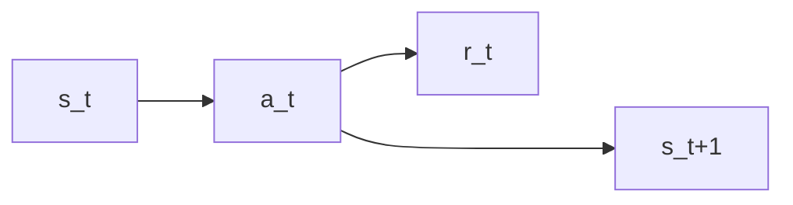
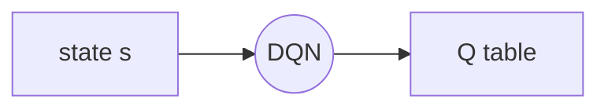
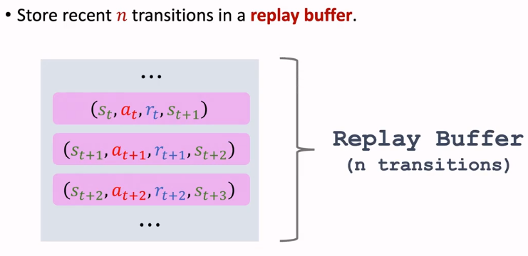
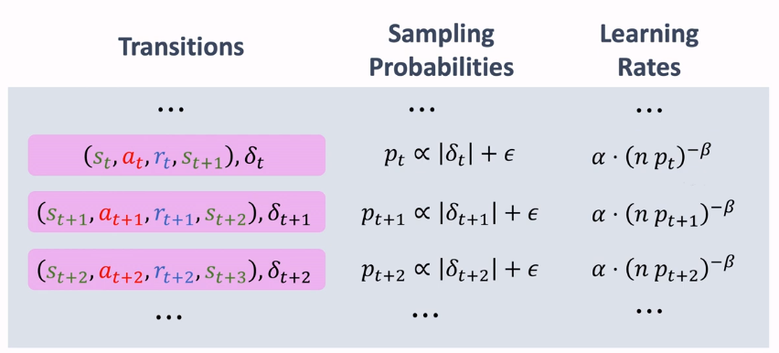
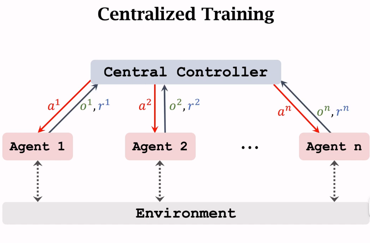
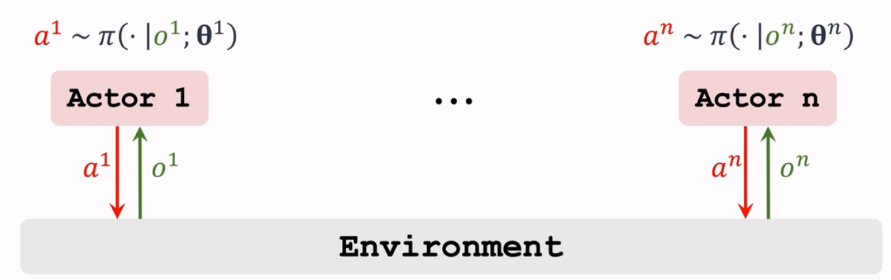

# multi-step TD Target
Q-learning -> training optimal action-value function $Q^*(s,a)$
TD target: $$y_t=r_t+\gamma \cdot \mathop{max}\limits_{a}Q^*(s_{t+1},a)$$
one-step TD target:

## multi-step return
$ U_t = R_t + \gamma \cdot U_{t+1}=R_t+\gamma \cdot R_{t+1} + \gamma^2 \cdot U_{t+2} = ...$

## multi-step with Q-Learning
$y_t = \sum_{i=0}^{m-1} \gamma^i \cdot R_{t+i} + \gamma^m \cdot U_{t+m}$

* m=1: one-step TD target

# Experience replay

* TD target: $y_t = r_t + \gamma \cdot \mathop{max}\limits_{a}Q(s_{t+1},a_{t+1})$
* TD error: $\delta_t=q_t-y_t$, $q_t = Q(s_t,a_t; \bm{w})$
* Goal: make $q_t \to y_t$
* TD learning: $L(\bm{w})=\frac{1}{T}\sum_{t=0}^{T} \delta_t^2/2$
***
* A transition: $(s_t, a_t, r_t, s_{t+1})$
## shortcoming of prototype
* transition only use once
* consecutive states are strongly correlated

* remove old transations to keep size

## TD with Experience Replay
* Find $\bm{W}$ by minimizing loss
* Stochastic gradient descent (SGD)
   * use minibatch randomly sample some of the transitions
   * use the average decent to update the $\bm{w}$

## improvement

# multi-agent reinforcement learning 

## settings
* fully cooperative
* fully competitive
   * one agent's gain is the other agent's loss
* mixed cooperative and competitive
* self-intrested
   * agents' reward may or may not be influenced by other agents

## hard point
state $S'$ depends on all agents' actions

## rewards
 $R^i$ depends on Agent $i$ as well as the other agents' actions

## policy network
* Each agent has its own policy network: $\pi(a^i|s^i, \bm{\theta}^i)$
* Policy network can be exchangeable or not

## uncertainty in the return
* the reward $R^i_t$ depends on $S_t$ and $\{A_t^i\}$
* the return, $U_t^i$ depends on:
   * all future states $\{S_{t+j}\}_j$
   * all future actions $\{A_{t+j}^i\}_j$

## state-value function
* one agent's state-value function: $V^i(s^i; \bm{\theta}^1, ..., \bm{\theta}^n)$ depends on all the agents' policies
* if one agent changes its policy, the other agents' state-value function will be affected

> 改变自己的策略，其他agent的状态值函数也会受到影响， 不一定自己的$V^i$会提高

## convergence
> 无法通过改变策略来提升回报

### singel-agent policy Learning
$J(\bm{\theta})= \mathcal{E}_S[V(S;\bm{\theta})]$
* learn the policy networks' parameters $\bm{\theta}$, by $\mathop{max}\limits_{\bm{\theta}}J(\bm{\theta})$
* **Convergence**: $J(\bm{\theta})$ stops increasing

### multi-agent policy learning
**Nash Equilibrium**
* while all the other agents' policies are the same, the policy of the current agent cannot get better expected return by changing its own policy 
* Every agent is playing a best-response to the other agents' policies
* Nash equilibrium indeicates convergence because no one has any incentive to deviate

## difficulty
> 简单将多个agent的策略组合起来，由于机器人之间也会相互影响，因此很难达到收敛。

## architecture
* fully decentralized
* fully centralized
* centralized training with decentralized execution:
   * central controller is used during training. The controller is disabled after training

## partial observations
* an agent may or may not have fully knowledge of the state $s$ 
* let $o^i$ be the i-th agent's obeservation
* partial observation: $o^i \neq s$
* fully observation 

## fully decentralized execution
> 本质是 single-agent policy learning

### FD actor-critic method
dose not work well

### FC actor-critic method

$\pi(a^i|o^1, ..., o^n;\bm{\theta}^i)$ for all $i=1,2,\dots,n$
* the central controller knows all actions and observations
* the controller has n policy networks and n value networks
> 策略网络结构可能相同，参数可能不同

### shortcoming
* communication and sychronization cost time 
* real-time decision is impossible
> 慢， 中央亲自部署，亲自指挥，所有动作都要听中央

## centralized training with decentralized execution
> 比较流行

* each agent has its own policy network (actor): $\pi(a^i|o^i, \bm{\theta}^i)$
* the central controller has n value networks (critic): $q(\bm{o},\bm{a}; \bm{w}^i)$
#### 
* **centralized training**: during trainings, the central contronller knows all the agents' observations, actions, and rewards
* **decentralized execution**: during execution, the central controller and its value networks are not used

## centralized training
* the central controller trains the critics $q(\bm{o},\bm{a}; \bm{w}^i)$
* input: all actions, all observations, i-th rewards
#### 
* each agent locally trains the actor $\pi(a^i|o^i, \bm{\theta}^i)$, using policy gradient
* to update $\bm{\theta}^i$, the policy gradient algorithm takes as input $(a^i, o^i, q^i)$

## decentralized execution

## parameter sharing
* $\bm{\theta}^i = \bm{\theta}^j$, $\bm{w}^i = \bm{w}^j$, for some i,j
> do not share parameters if the agents are non-exchangeable

