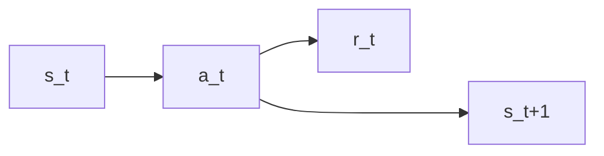
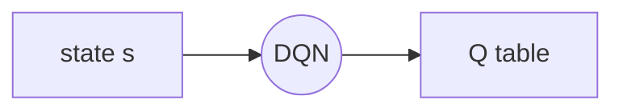

# multi-step TD Target
Q-learning -> training optimal action-value function $Q^*(s,a)$
TD target: $$y_t=r_t+\gamma \cdot \mathop{max}\limits_{a}Q^*(s_{t+1},a)$$
one-step TD target:

## multi-step return
$ U_t = R_t + \gamma \cdot U_{t+1}=R_t+\gamma \cdot R_{t+1} + \gamma^2 \cdot U_{t+2} = ...$

## multi-step with Q-Learning
$y_t = \sum_{i=0}^{m-1} \gamma^i \cdot R_{t+i} + \gamma^m \cdot U_{t+m}$

* m=1: one-step TD target

# Experience replay

* TD target: $y_t = r_t + \gamma \cdot \mathop{max}\limits_{a}Q(s_{t+1},a_{t+1})$
* TD error: $\delta_t=q_t-y_t$, $q_t = Q(s_t,a_t; \bf{w})$
* Goal: make $q_t \to y_t$
* TD learning: $L(\bf{w})=\frac{1}{T}\sum_{t=0}^{T} \delta_t^2/2$
***
* A transition: $(s_t, a_t, r_t, s_{t+1})$
## shortcoming of prototype
* transition only use once
* consecutive states are strongly correlated

* remove old transations to keep size

## TD with Experience Replay
* Find $\bf{W}$ by minimizing loss
* Stochastic gradient descent (SGD)
   * use minibatch randomly sample some of the transitions
   * use the average decent to update the $\bf{w}$

## improvement

