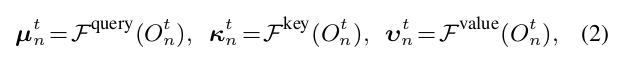

# background

> Condorect’s Jury Theorem indicates that, under certain assumption, adding more voters in a group would increase the probability that the majority chooses the right answer

>  Thus it is believed that a next grand challenge of AI is to answer how multiple intelligent agents could learn human-level collaborations

- applications: search-and-rescue, area coverage, harbour protextion
- 目前主要的多机器人合作，其“超人”之处大部分体现在合作打游戏上.  **然而**, 这些都是建立在 low-demensional observation 之上
- 复杂的场景下的机器人的应用有：
  - embodied navigation
  - instruction following
  - embodied question-answering
- **However**, most of them either do not support multi-agent setting, or little consider planning. 

# challenge

there is still a huge gap between MAS and realistic visual environments.

# goal 

multiple agents are entailed to cooperatively navigate across photo-realistic environments to reach target locations

- three tasks:
  - common goal: agents assigned a same goal picture
  - specific goal: agents are assigned different goal pictures
  - ad-hoCoop: e.g. 3 agents for training and 4 for execution, built on common goal

# selling point

- dataset from Gibsonv1

- a novel memory-augmented **communication** approach for MAVN
  - the agents need to exchange information (e.g., past experience, current perception, future plan, etc)
- Diverse MAVN task settings are explored to cover many core challenges in MAS/MARL, with packaged evaluation tools and baselines. 

# details

## basic settings

- goal: a target photo
- each agent does not know each others' positions
- agent observe the evironment by panaoramic-views
- agents know partially of the environment
- agents can exchange their information via a low bandwidth communication channel

## action space

- translational and rotational velocities:
  - e,g. $a_n^t=(1,0.5)$, means the agent will move at the maximum speed and half-max translational velocity in next 1s

# methods

## map building moudule

- $S_n^t=\mathcal{F}^{map}(O_n^t, p_n^{t-1,t},S_n^{t-1})$

- $S_n \to (256+4)\times L\times L$ 
  - 256 for visual features
  - 4 for probability map of **obstacle** and three binary maps storing **explored area**, **agent past trajectory** and **current location**
  - $L=3m$

## memory-augmented communication module

- some discarded information may be useful in the future
- the communication is mainly about agents’ current observations, failing to involving their past experience explicitly
- It is difficult if an agent wants to know another agent’s status in a previous time step.
  
   
  
  	

### vanila Handshake strategy

request

- each agent compress its local observation $O_n^t$ to query $\mu_n^t,$ key $\kappa_n^t$ and value $v_n^t$. 

- only causes little bandwidth transmission

match

- each agent derives a matching score $s_{n,m}=\psi(\mu_n^t, \kappa_m^t)$ , $\psi$ is learnable. 
-  viewed as the importance of the information provided by the supporter m for the requester n.

select

- $\omega_n^t=\sum s^t_{n,m^t}v^t_{m^t}$ is used to help the requester n take an action decision

 

### Memory-Augmented Communication

each agent n maintains a private, external memory $M_n^t$ which stores all its past generated communication information $\{v_n^{1:t-1}, \kappa_n^{1:t-1}\}$

request 

**request**

**match**

- $s^t_{n,m,i:t}=\psi(\mu_n^t,\kappa_m^{1:t})$
- $s^t_{n,m}=\mathop{mean}\limits_{t'}(s^t_{n,m,t'})$, $\hat{v}_m^t=\mathop{mean}\limits_{t'}s^t_{n,m,t'} v_m^{t'}$
- The agent n also computes the correlations between the query $\mu_n^t$ and all its current and past keys $\kappa_n^{1:t}$ in M. 
  - output is $s^t_{n,n}$ and $\hat{v}_n^t$

**select**

- learning who to communicate
- set $\eta=1/N$
- $\omega_n^t=s^t_{n,n}\hat{v}_n^t+\sum_{m^t}s^t_{n,m^t}\hat{v}^t_{m^t}$

**store** 

- agent store $\{v_n^t, \kappa_n^t\}$ in the memory. 

 

$a_n^t=\pi_{\theta_n}(O_n^t, S_n^t, \omega_n^t, g_n)$

## Fully Decentralized Learning

- actor-and-critic
- PPO
- Loss: 
  
  
- there is no interaction between agents, the policies are learned independently.
