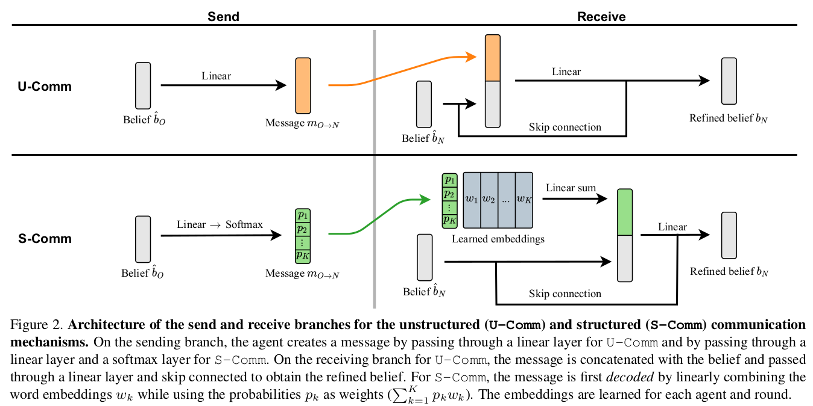
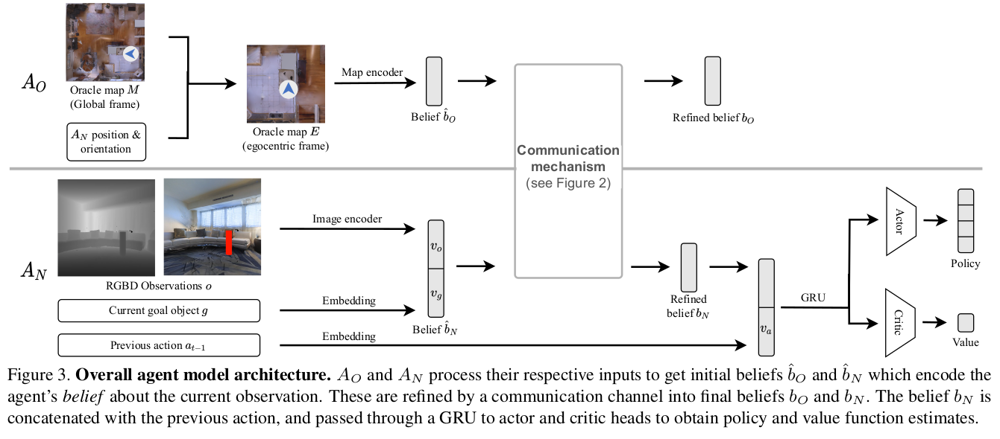

> -  interpreting emergent communication
> - multi-ON --> CoMON

**两个机器人，oracle知道全局信息和navigator的位置；navigator知道任务目标，需要不断去通过交流来获取信息**

# task

## two agents:

- oracle: disembodied, cannot navigate in the environment, access to oracle information of the environment’s state
- navigator: embodied, navigates and interacts with the environment. 

## observations

$A_O$ semantic information of the global occupancy grid

$A_N$ multiON agent 

## action 

two agents send messages to each other

# methods

## communication mechanisms

- unstructured and structured

> Their key difference is that the **unstructured mechanism implements free-form communication via a real-valued vector**, whereas the **structured communication mechanism has an inductive bias through the imposed message structure**.

>  二者的区别主要在于对于接收的信息，是否要进行进一步编码。S-Comm中二者各自保存了一个“密码本”

Each round of communication involves the two agents synchronously sending a message to each other.

## network

