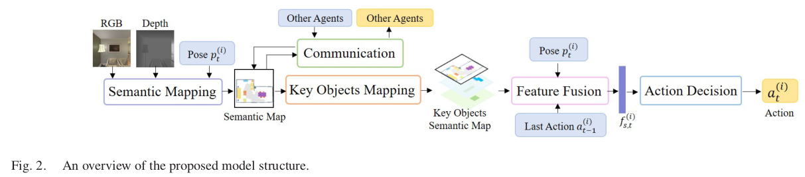
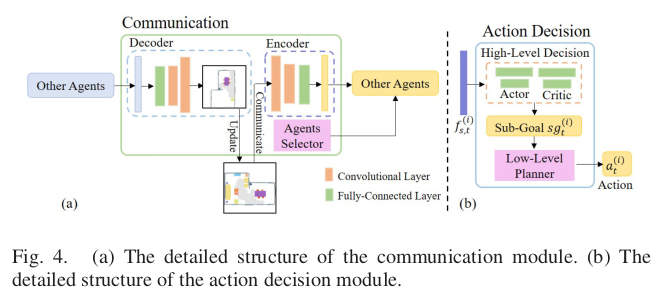

# goal

multiple agents collaborate with others to find multiple target objects. 

multiple agents collaborate with each other to find multiple different objects with the egocentric visual observations and the class labels of target objects. 

# challenge

requires agents to learn reasonable collaboration strategies to perform efficient exploration under the restrictions of communication bandwidth. 

- it is difficult for multiple agents to learn effective strategies to avoid invalid exploration and improve the navigation efficiency 
- there exist bandwidth restrictions in communication among multiple agents

# selling point 

目前并没有两个以上的机器人的合作的文章（dong的不太算）

- extends the single-agent visual semantic navigation to the multi-agent setting. 
- develop a hierarchical decision framework based on semantic map, scene prior knowledge, and communication mechanism to solve the multi-agent visual semantic navigation task.

# method

agents need to decide which object to navigate to based on their observations

5 module:

1. semantic mapping module: 
   1. generates a top-down semantic map with RGB and depth images of egocentric visual observations --> mask-RCNN
2. Key Objects Mapping
   1. 提取物体之间的隐藏关系 --> Visual semantic navigation using scene priors
   2. judges whether there exist key objects using the scene prior knowledge graph in the current visual observation
3.  communication
   
   
   1. Information Processing: encode and decode the relevant information 
      1. encode the constructed semantic map into a one-dimensional vector to reduce the amount of communication information
      2. decode the received communication vector into a semantic matrix
      3. *We train the encoder and decoder in advance* 
      4. The original semantic maps are fed into the encoder and the decoder successively to generate recovered semantic maps, -->  为了降低传输成本，将大的图片decode成一维向量
   2. Agent Selection
      1. helps agents choose the specific agents to transmit the communication information before each round of communication
      2. 非学习的，启发式的
4. Feature Fusion
   1. extract the feature of the current state of the agent.
5. Action Decision
   1. High-Level Decision  --> PPO--> decide the sub-goal
   2. Low-Level Decision --> 找到最短路径 --> decide the specific actions 
