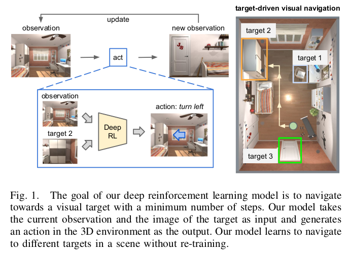

# goal

navigating a space to find a given target goal using only visual input

# challenge

general DRL approaches are designed to learn a policy that depends only on the current state, and the target goal is implicitly embedded in the model parameters. Hence, it is necessary to learn new model parameters for a new target. This is problematic since training DRL agents is computationally expensive. 

> 对于新的模型，需要重新学习，迁移性低，而训练又很费时。

# selling point

Essentially, an agent learns to take its next action conditioned on both its current state and target, rather than its current state only.  

Hence, there is no need to re-train the model for new targets. A key intuition that we rely on is that different training episodes share information. 

> 可以学习到物体之间隐含的关系 （不一定）

主要贡献是提供了一个system可以进行训练

# methods

