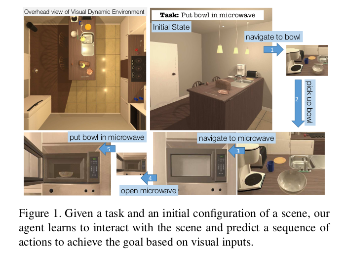
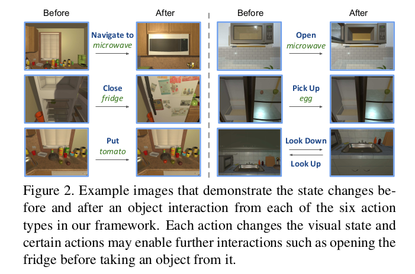
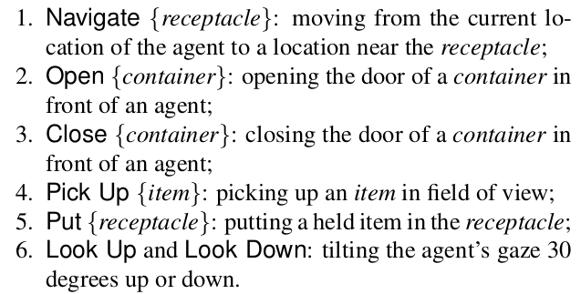
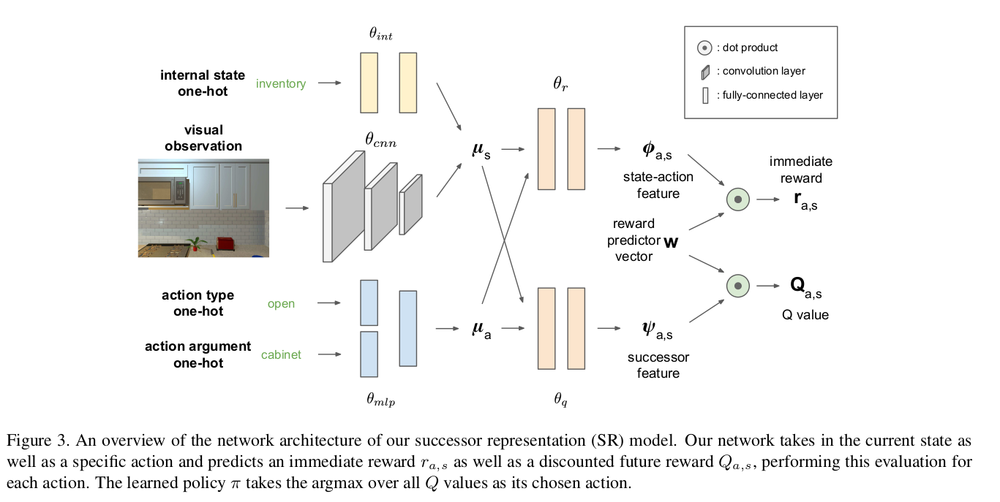
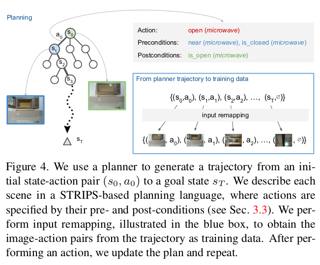
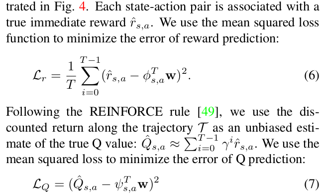

# goal

**Visual Semantic Planning (VSP)**

> the task of predicting a sequence of actions from visual observations that transform a dynamic environment from an initial state to a goal state.

# changllege

1. performing each of the above actions in a visual dynamic environment requires **deep visual understanding of that environment**, including the set of posible actions, their preconditions and effects, and object affordances.
2. 视觉观察和可能的行动的多变性使得NAı̈ve探索变得棘手。
3. 发出一系列操作，使代理以目标状态结束，并且前面操作的效果满足前面操作的前提条件
4. 视觉规划的一个令人满意的解决方案应该能够实现交叉任务转换;**之前关于一个任务的知识会让你更容易学习下一个任务**

# selling point

 

# method 

## framework

THOR:

six action types:

## objects and actions

### objects

物体分为两类：

- *items* that are small objects (mug, apple, etc.) which can be picked up, held, and moved by the agent to various locations in the scene
- *receptacles* that are large objects (table, sink, etc.) which are stationary and can hold a fixed capacity of items.

receptacles 中包含了container子类，可以装东西。

### actions

> 没有分解移动的动作，直接用navigation代替

## borrowed solver 

- navigate --> Target-driven Visual Navigation in Indoor Scenes using Deep Reinforcement Learning
- planning language --> STRIPS (定义环境中的规则）

## Successor Representation

[详细解释](https://zhuanlan.zhihu.com/p/351989417)

## model

使用神经网络来模拟SR中的 $\phi , \bf{w}, \psi$

## imitation learning

- 使用STRIPS监督学习

- Loss function

Final Q loss:

$$\mathcal{L}_T=\mathcal{L}_r+\mathcal{L}_Q$$